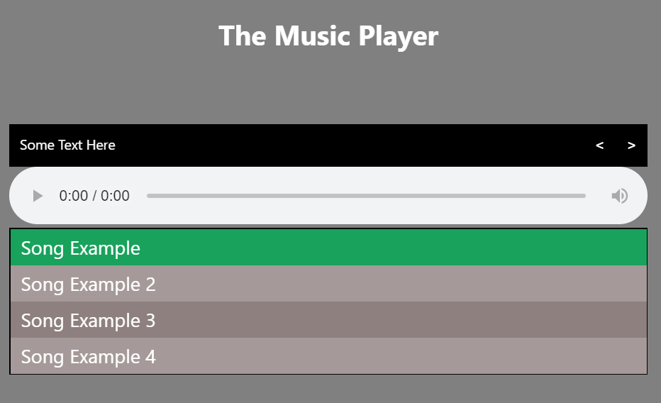

# Music Player

👋 Welcome to JS challenge! 
This challenge is to write JS code for a music player.

## A Look at the App

Here's a glimpse for the app

For a more in-depth tour, check out this video:

[Video 1](https://www.youtube.com/watch?v=ZdKS_-idbiM)

[Video 2](https://www.youtube.com/watch?v=rswXCGWtjDo)

## ToDo

[x] - build the HTML list of songs from files "songs.txt" in each of the songs folder
[x] - add event listener on each song link
[x] - when selecting a song -
    [x] - mark selected song in the list
    [x] - update the player title
    [x] - load and play song
[x] - add event listener to the next and prev buttons
[x] - when button (next/prev) clicked handle song selection accordingly
[x] - handle start of next song in the list when song finish playing 
[x] - handle shuffle option
[ ] - handle autoplay option

